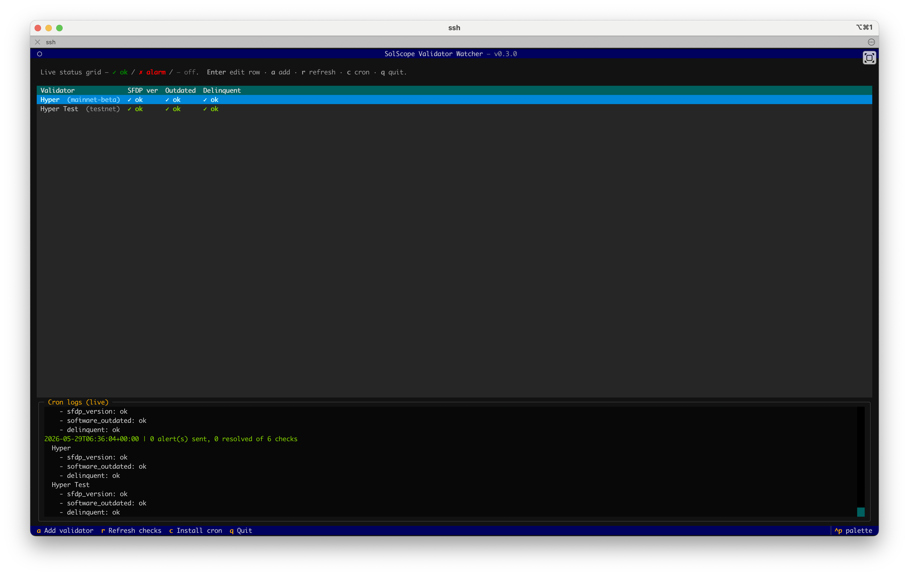
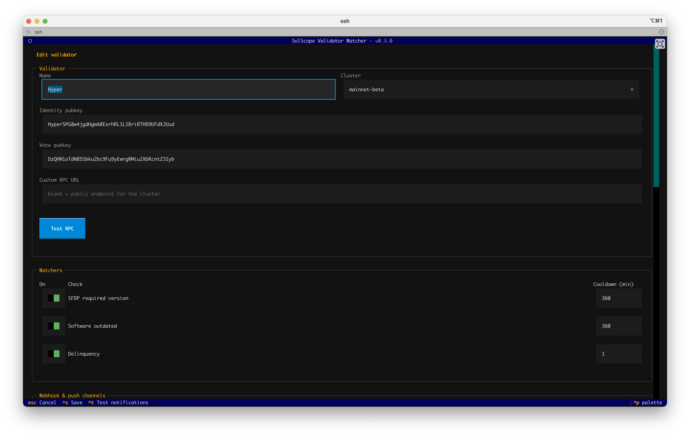

# solscope-validator-watcher

Cron-friendly Solana validator monitoring you can run on your own validator host.
It reproduces the alerting that [SolScope](https://solscope.io)
provided as a hosted service, with no server or database required: a config file, a
state file for cooldowns, and a one-minute cron job.

It ships with a full-screen terminal UI (built on [Textual](https://textual.textualize.io))
for managing **multiple validators** — each with its own watchers and notification
channels — plus a non-interactive `run-once` command for cron.

## Screenshots

The dashboard is a live status grid (one row per validator, one column per watcher)
with the cron log streaming underneath:



Editing a validator groups its settings into clear sections — identity, watchers and
their cooldowns, and notification channels:



## Watchers

| Watcher | What it checks |
|---|---|
| `sfdp_version` | Your node's version against the SFDP **required** minimum from `api.solana.org`. Detects whether the node runs Agave or **Firedancer** (by its version line) and compares against that client's minimum (`agave_min_version` or `firedancer_min_version`). |
| `software_outdated` | Your node's version against the **latest stable** Agave release on GitHub (`anza-xyz/agave`) within your node's current major version line (e.g. a `v3.1.x` node is compared to the newest `v3.x.y`). |
| `delinquent` | Whether your vote account is reported delinquent via `getVoteAccounts`. |

Each watcher has its own `cooldown_minutes` so a per-minute cron won't spam you while
a condition persists. Cooldown state is tracked in a JSON state file alongside the config.

## Notification channels

Configure any combination under `notifications`:

- `slack_webhooks` — Slack incoming webhook URLs
- `discord_webhooks` — Discord webhook URLs
- `webhooks` — generic webhooks (`{"text": "..."}` POST body)
- `ntfy_topics` — [ntfy.sh](https://ntfy.sh) topics
- `pagerduty_integration_keys` — PagerDuty Events API v2 routing keys
- `twilio` — Twilio SMS. You must supply your **own** Twilio sending source (`account_sid`, `auth_token`, and a verified `from_phone`) plus the destination `to_phones`. Unlike the hosted SolScope service, there is no shared sender — SMS only works if you provide your own Twilio account.
- `smtp_email` — SMTP email (`host`, `port`, `username`, `password`, `from_email`, `to_emails`, `use_tls`)

### Recovery notifications

When a watcher's condition clears (e.g. your node comes back to the required
version, or stops being delinquent), every configured channel automatically
receives a `RESOLVED: ...` message. PagerDuty goes further: the original
incident is **auto-resolved** via a stable dedup key (`<identity>:<watcher>`),
so you don't have to close it by hand. This is always on — no extra config.

Cooldowns still apply while an alert persists (so you aren't spammed), but a
recovery notification is sent exactly once on the transition back to healthy,
and the cooldown resets so a re-occurrence alerts you immediately.

## Install

Install into a virtual environment. This is the recommended approach everywhere,
and on modern Debian/Ubuntu (PEP 668 "externally-managed-environment") it is
required — a system-wide `pip install` will be refused.

```bash
# Create a venv (one-time). Anywhere is fine; this keeps it with the config.
python3 -m venv ~/.solscope-validator-watcher/venv

# Activate it, then install
source ~/.solscope-validator-watcher/venv/bin/activate
pip install solscope-validator-watcher
```

> On Ubuntu you may first need `sudo apt install python3-venv` (and `python3-pip`).

After activating the venv, the `solscope-validator-watcher` command is on your
`PATH`. You don't need to keep the venv activated for cron — see
[Run (cron)](#run-cron), which records the venv's Python automatically.

### Run it from anywhere (optional)

To run `solscope-validator-watcher` without activating the venv, symlink its
executable into `/usr/local/bin`. The script's shebang points back at the venv's
Python, so it keeps using the right environment regardless of where you call it:

```bash
sudo ln -sf ~/.solscope-validator-watcher/venv/bin/solscope-validator-watcher \
  /usr/local/bin/solscope-validator-watcher
```

Now just run `solscope-validator-watcher` from any directory. Upgrades inside the
venv (`pip install --upgrade ...`) are picked up automatically — you don't need
to recreate the symlink.

If you prefer not to manage a venv yourself, [`pipx`](https://pipx.pypa.io) does
it for you:

```bash
pipx install solscope-validator-watcher
```

### From source (for development)

```bash
python3 -m venv .venv && source .venv/bin/activate
pip install -e .
```

## Update

```bash
solscope-validator-watcher update
```

This upgrades the package inside the virtualenv that owns the command — it
resolves the `/usr/local/bin` symlink if you created one, so you don't need to
activate the venv first. (`upgrade` works too.) It is equivalent to running
`pip install --upgrade solscope-validator-watcher` inside that venv.

## Configure (the TUI)

The TUI is the primary entrypoint. Just run the command with no arguments:

```bash
solscope-validator-watcher
```

By default everything lives under `~/.solscope-validator-watcher/`
(`config.json`, the cooldown state file, and `watcher.log`), so no root access is
required. Use `--config <path>` to point at a different file.

The dashboard is a **live status grid**: each row is a validator, each column is a
watcher, and every cell shows that check's current state — green `✓ ok`, red
`✗ alarm`, dim `— off` (disabled), or yellow `! err` (the check itself failed).
All checks run on startup so you get an immediate picture, and you can re-run them
any time with **`r`**. A **live log pane** at the bottom tails the cron log
(`~/.solscope-validator-watcher/watcher.log`), so you can watch each scheduled run
stream in as it happens.

- **Enter** on a row opens the editor for that validator; **`a`** adds a new one.
- In the editor: set cluster (or a custom RPC URL), identity/vote keys, toggle each
  watcher and its cooldown, and fill in notification channels.
  - **`Ctrl+S`** save · **`Ctrl+T`** send test notifications · **`Ctrl+D`** delete · **`Esc`** cancel
  - **Test RPC** button verifies connectivity (and reports the detected client, e.g.
    Agave/Firedancer, and version) before you save.
- **Saving a validator automatically installs/refreshes the one-minute cron job**, so
  monitoring is active without an extra step. Press **`c`** to (re)install it manually
  — handy if you move the virtualenv or the cron update was skipped.
- Press **`r`** to refresh the grid, **`q`** to quit.

Prefer to edit by hand? Copy [`config.example.json`](./config.example.json) and edit it.

### Custom RPC endpoint

By default each validator uses the public endpoint for its cluster
(`https://api.<cluster>.solana.com`). Set a per-validator `rpc_url` to use your own RPC —
the `cluster` value is still used for the version checks. Leave it `null`/blank for the
public endpoint.

## Run (cron)

The watchers run via the non-interactive `run-once` command, which the TUI's "install
cron" action wires up for you. To do it manually (from inside the activated venv):

```bash
solscope-validator-watcher run-once          # run all validators once (used by cron)
solscope-validator-watcher install-cron      # install the one-minute cron job
```

cron does **not** inherit your activated virtualenv, so `install-cron` bakes the
**absolute path of the current Python interpreter** into the cron line. As long as
you run `install-cron` (or press `c` in the TUI) from inside the venv where you
installed the package, the cron job will use that same venv automatically — no
activation needed at run time. The installed line looks like:

```
* * * * * /home/solana/.solscope-validator-watcher/venv/bin/python -m validator_watcher run-once --config "..." >> "..." 2>&1
```

`install-cron` accepts `--config`, `--python-bin` (override the interpreter), and
`--log-file`.

## Recommended: high-availability setup

A monitor is only useful if it's running when something breaks — so don't rely on a
single host to watch itself. Because one config can hold **multiple validators**, the
most resilient setup is:

1. Add **both** your mainnet and testnet validators to the config (in the TUI, press `a`
   twice).
2. Install the watcher + cron on **both** hosts, each running that same config.

That way every validator is observed by two independent hosts. If one host goes down (the
exact moment you most want an alert), the other host is still checking it and will fire the
notification. The per-watcher cooldowns keep the two hosts from double-alerting you into
noise.

## License

MIT — see [LICENSE](./LICENSE).
